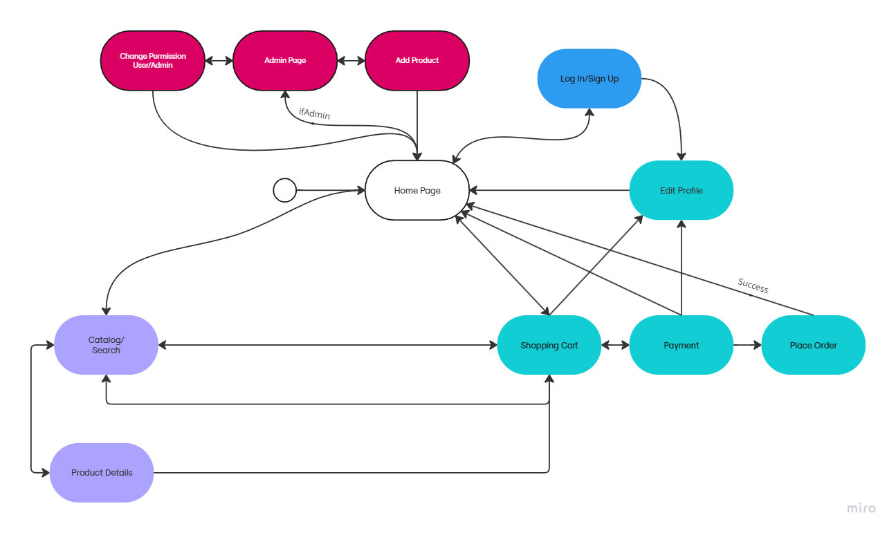

# USP 33+&frac13; Store

## Project Report
---
- Joao Francisco Caprioli Barbosa Camargo de Pinho - 10748500
- Arturo Javier Kolster Borges - 16285381

This is a simple **Online Store** project built with HTML, CSS, and basic JavaScript. The website will offer a vinyl listing page, a product grid for showcasing products, a shopping cart, a log in page, and a page for finalizing orders. The site is structured specifically for easy navigation.

---
# TODO:
   - Comment all relevant css blocks


## Requirements
The project will include:
- A homepage that displays a banner and product information. &check;
- A products section with a grid layout, showcasing available vinyls. &check;
- Persistent shopping cart using local storage. &check;
- User registration and authentication (login/logout), with two types of users: Admins and Clients. &check;
- Product/services records include, at least: name, id, photo, description, price, quantity (in stock), and quantity sold. &check;
- Selling Products: Products are selected, their quantity chosen, and are included in a cart. Products are purchased using a credit card number (any number is accepted by the system). &check;
- Product/Service Management: Administrators can create/update/read/delete (crud) new products and services. For example, they can change the stock quantity. &check;
- Your functionality: Create a functionality that is specific to your application. &check;
- Responsive design for various screen sizes (desktop, tablet, mobile). &check;

**Additional requirements** we might be able to implement:
- Product search and filter functionality. &check;
- Sample playing on product page. &check;

---

## Project Description

### Functionalities Prototyped in the First Milestone:
1. **Homepage**:
   - A hero banner welcomes the user and promotes special offers.
   - "Start Playing!" button directs users to the products section.
   
2. **Products Section**:
   - Displays a grid of Vinyls with covers, names and prices.
   - Designed for easy scalability with more vinyls in the future.

3. **Shopping Cart**
   - Displays selected Vinyls in a Shopping Cart style

4. **Log in/Sign Up Page**
   - A page for logging in or creating an account

5. **Search Bar**: 
   - Functionality to search for products by name, artist name and genre.

6. **Product Cart**:
   - Users will be able to add vinyls to a cart and proceed to checkout.

### Planned Features:
- **User Authentication**: Allow users to create accounts and log in for a personalized shopping experience.
- **User Permissions**: Admins and users have different permissions. Admins can add/delete products, add/update stock quantities, add/remove user permissions.


### Extra Features
- **None Planned**

### Project Images
   [Gallery of Store Screenshots](git_images)

### Navigation Flow:



- Some sections are available in the Navigation Bar, but most are hidden behind the product or cart sections
- Magenta-Colored Pages require being logged in with Admin Permissions
- Cyan-Colored Pages require being logged in

---

## Comments About the Code
- **HTML Structure**: Standard use of basic HTML tags and classed divs
- **CSS Layout**: Flexbox and grid are used for creating a responsive design. Media queries will ensure the design adapts to various screen sizes.
- **JavaScript**: Most pages include .js scripts to handle functions, animations stylings or local storage.

---

## Test Plan
At the first stage, manual testing will be conducted to ensure:
- Proper navigation between the homepage, products, and other sections.
- Product grid layout adjusts correctly for different screen sizes (desktop, tablet, mobile).
- Buttons like "Shop Now" and the form submit work as expected.

Final stage automated testing through Postman:
- **Log in/Sign up**: Test different permissions for admins and users
- **Shopping Cart and buying procedure**: Test if the shopping cart updates correctly
- **Adding/Editing Products,Users**: Test if it's possible do add/edit both products and users.
---

## Test Results
Initial manual tests showed:
- Navigation works smoothly between all sections.
- Product grid displays correctly on desktop and mobile views.
- Buttons and form fields are functional.
- Pages work with simple implementations of their uses.

Final Tests showed:
- Database works correctly for all users
- All pages connect correctly to backend
- All functions are fully functional

Note that the initial tests were made simply with a web-browser, but final tests mixed browser tests with Postman tests through HTTP requests.

This made it simpler to get straight to the point responses. For example, listing all products or all users. For some part, we were testing wheter these data points were correctly loaded to their pages, but sometimes, the HTTP requests weren't even getting the correct responses:

```js
GET localhost:3000/auth/users

Correct Response:
{
   {
      "name": {"first user's name"},
      ...
   },
   ...
}

Incorrect Response:
   Unable to GET /auth/users
```

These Postman tests made it easier to debug the project.

---

## Build Procedures
To run this project locally:
1. **Clone the Project and go to the directory**: 
   
   ```bash
   git clone [repository link]
   cd online-store
2. **Install all dependencies**
   
   ```bash
   npm install
3. **Generate JWT Token**
   
   ```bash
   node generatePrivateKey.js
   ```
   Paste the token onto .env, in JWT_SECRET
   
4. **Start the Mongo Server**
   
   On one terminal window, paste the following commands:
   ```bash
   mkdir data/db
   mongod --dbpath data/db
   ```
   This will create the database and start it up.

5. **Import data to the database**
   
   On a new terminal, do the following commands:
   ```bash
   node scripts/users.js
   node server/importProducts.js
   ```
6. **Start the Web Server**
   
   On the same terminal as the imports, do:
   ```bash
   node server/server.js
   ```
7. **Access the website on your browser:**
   
   [localhost:3000](localhost:3000)

8.  **Create an account or use the standard accounts to test**
   
   |email|password|role
   |-----|--------|----
   |jota@usp33.br|password123|admin
   |arturo@icmc.com.br|password|admin
   |jose@gmail.com|jose123|viewer
   

## Comments
   This project was developed for the Introduction to Web Design Course. Therefore, it is not a professional project nor a perfect website.

   Additionally, we highlight, on our journey, the steep learning curve between HTML/CSS/js and frameworks/databases.