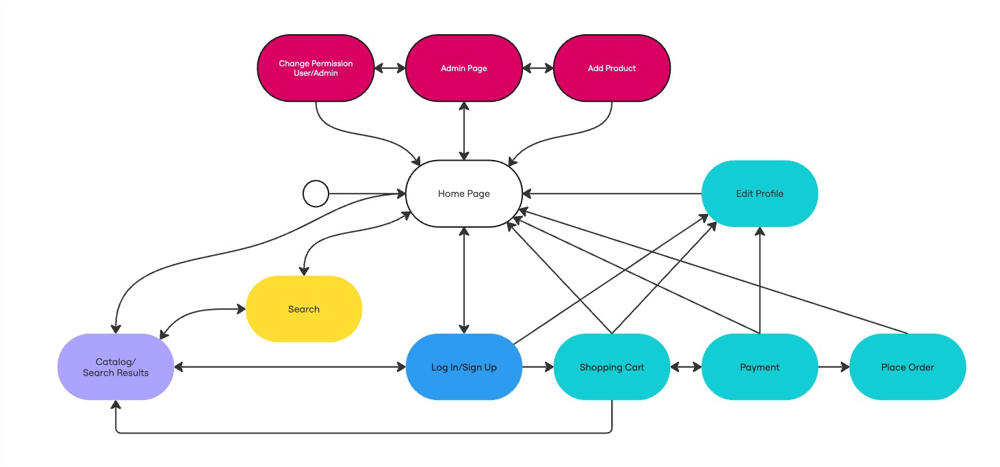

# USP 33+&frac13; Store

## Project Report
---
- Joao Francisco Caprioli Barbosa Camargo de Pinho - 10748500
- Arturo Javier Kolster Borges - 16285381
- Pedro Liduino do Nascimento - 11796847

This is a simple **Online Store** project built with HTML, CSS, and basic JavaScript. The website will offer a vinyl listing page, a product grid for showcasing products, a shopping cart, a log in page, and a page for finalizing orders. The site is structured specifically for easy navigation.

---
# TODO:
   - Edit Profile Page
   - Add Product Script
   - Search Product Script/Page
   - Finalize Order Page
   - Product Quantity in Stock
   - Add images and covers "alt" description
   - Style Admin pages differently


## Requirements
The project will include:
- A homepage that displays a banner and product information. &check;
- A products section with a grid layout, showcasing available vinyls. &check;
- Persistent shopping cart using local storage.
- User registration and authentication (login/logout), with two types of users: Admins and Clients.
- Product/services records include, at least: name, id, photo, description, price, quantity (in stock), and quantity sold.
- Selling Products: Products are selected, their quantity chosen, and are included in a cart. Products are purchased using a credit card number (any number is accepted by the system).
- Product/Service Management: Administrators can create/update/read/delete (crud) new products and services. For example, they can change the stock quantity.
- Your functionality: Create a functionality that is specific to your application. &check;
- Responsive design for various screen sizes (desktop, tablet, mobile). &check;

**Additional requirements** we might be able to implement:
- Product search and filter functionality.

---

## Project Description

### Functionalities Prototyped in the First Milestone:
1. **Homepage**:
   - A hero banner welcomes the user and promotes special offers.
   - "Start Playing!" button directs users to the products section.
   
2. **Products Section**:
   - Displays a grid of Vinyls with covers, names and prices.
   - Designed for easy scalability with more vinyls in the future.

3. **Shopping Cart**
   - Displays selected Vinyls in a Shopping Cart style

4. **Log in/Sign Up Page**
   - A page for logging in or creating an account


### Planned Features:
- **Product Cart**: Users will be able to add vinyls to a cart and proceed to checkout.
- **User Authentication**: Allow users to create accounts and log in for a personalized shopping experience.
- **User Permissions**: Admins and users have different permissions. Admins can add/delete products, add/update stock quantities, add/remove user permissions.


### Extra Features
- **Search Bar**: Functionality to search for products by name.


### Navigation Flow:



- Some sections are available in the Navigation Bar, but most are hidden behind the product or cart sections
- Magenta-Colored Pages require being logged in with Admin Permissions
- Cyan-Colored Pages require being logged in

---

## Comments About the Code
- **HTML Structure**: Standard use of basic HTML tags and classed divs
- **CSS Layout**: Flexbox and grid are used for creating a responsive design. Media queries will ensure the design adapts to various screen sizes.
- **JavaScript (Planned)**: Currently, the project does not have interactive JavaScript. Future iterations will include scripts for the shopping cart and log in procedures.

---

## Test Plan
At this stage, manual testing will be conducted to ensure:
- Proper navigation between the homepage, products, and other sections.
- Product grid layout adjusts correctly for different screen sizes (desktop, tablet, mobile).
- Buttons like "Shop Now" and the form submit work as expected.

**Future Testing**:
- **Log in**: Test different permissions for admins and users
- **Shopping Cart and buying procedure**: Test if the shopping cart updates correctly
- **TBD**: Not yet determined
---

## Test Results
Initial manual tests will show:
- Navigation works smoothly between all sections.
- Product grid displays correctly on desktop and mobile views.
- Buttons and form fields are functional but not yet connected to a back-end.

---

## Build Procedures
To run this project locally:
1. **Install a Code Editor**: [VS Code](https://code.visualstudio.com/), or any text editor of your choice.
2. **Clone the Project**: 
   ```bash
   git clone [repository link]
3. **Open Live Copy of Project on your Browser**: :D

## Problems

## Comments
