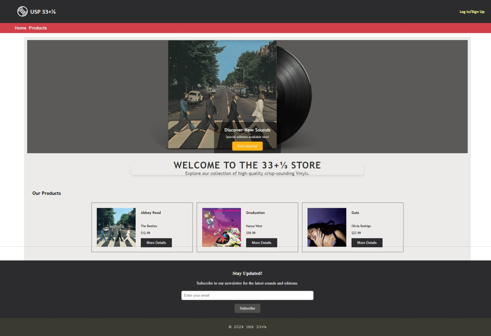
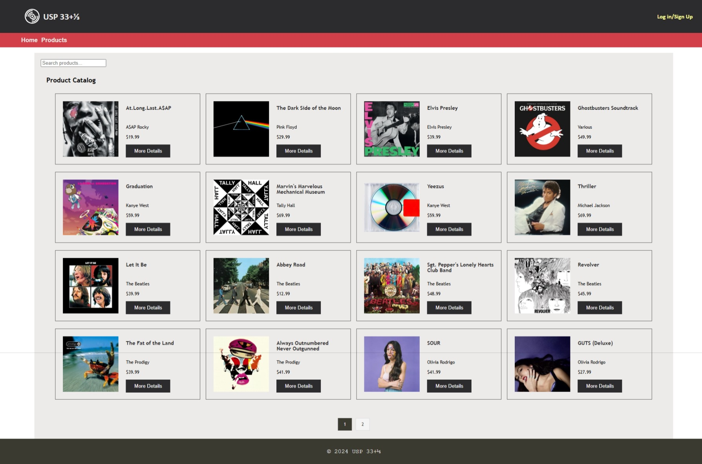
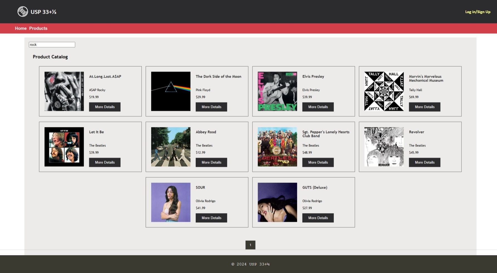
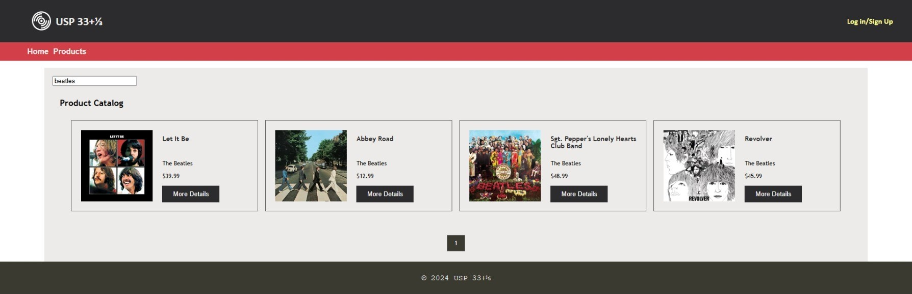
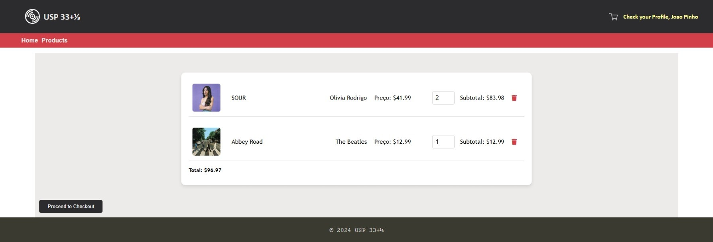
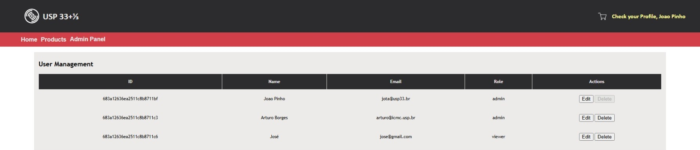
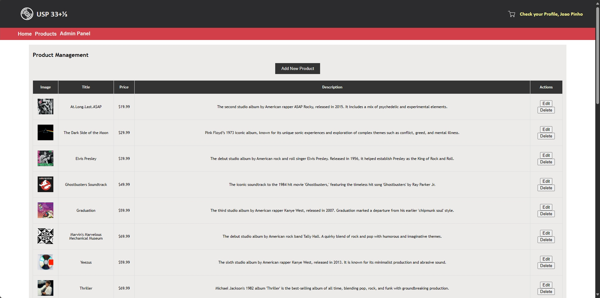

# USP 33+&frac13; – Screenshots & Features

This folder contains screenshots and short explanations of the main pages and features of the Music Store web application. It's designed to offer a seamless experience for browsing, searching, purchasing music, and administering content.

---

## Homepage

The homepage introduces users to the Store, showcasing featured albums, genres, or promotions. It's the starting point for exploration.

---

## Catalog

The catalog page displays a collection of music albums available for purchase. Each product includes the album cover, title, artist, and price.

---

## Search by Genre – Rock

Users can filter albums by genre. This screenshot shows results for the "Rock" category, returning only relevant items.

---

## Search by Artist – The Beatles

Users can search for albums by artist name. Here, the search returns albums by "beatles".

---

## Shopping Cart

The shopping cart displays the items the user has added. It includes quantity controls, item subtotal, and the overall total. Users can remove items or update quantities.

---

## Admin User Panel

Admin users can access this panel to view, manage, or remove registered users. It's essential for user moderation and administrative control.

---

## Admin Product Panel

Admins can add new albums, update product details, manage stock, or delete items. This panel is crucial for keeping the catalog up to date.

---
